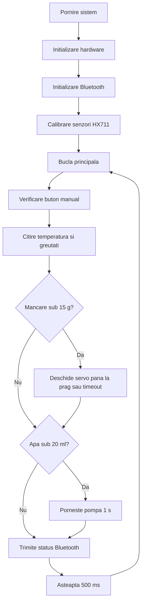

# Documentatie tehnica - Sistem de Hranire si Hidratare

## 1. Prezentarea proiectului

Proiectul implementeaza un sistem automat de hranire si hidratare pentru animale de companie, bazat pe Raspberry Pi Pico 2 W. Sistemul masoara cantitatea de mancare si apa din boluri, monitorizeaza temperatura apei si actioneaza automat doua mecanisme:

- un servomotor pentru deschiderea clapetei de mancare;
- o pompa comandata prin releu pentru completarea apei.

Pe langa functionarea automata, sistemul permite actionarea manuala a clapetei de mancare printr-un buton fizic. Valorile curente sunt trimise prin Bluetooth Classic SPP catre un telefon sau un terminal serial Bluetooth.

## 2. Obiective

- automatizarea alimentarii cu mancare si apa;
- masurarea separata a greutatii pentru bolul de mancare si bolul de apa;
- avertizarea utilizatorului daca temperatura apei depaseste pragul stabilit;
- transmiterea periodica a datelor de stare prin Bluetooth.

## 3. Platforma si dependinte

### Hardware principal

- Raspberry Pi Pico 2 W;
- doua module HX711 pentru citirea celulelor de sarcina;
- doua celule de sarcina, una pentru mancare si una pentru apa;
- servomotor pentru clapeta dozatorului de mancare;
- pompa de apa comandata prin releu sau tranzistor;
- senzor NTC pentru temperatura apei;
- buton pentru control manual;
- doua LED-uri de stare.

### Software

- limbaj C;
- Pico SDK;
- CMake;
- BTstack pentru Bluetooth Classic;
- suport ADC si PWM din Pico SDK.

In `CMakeLists.txt`, placa este setata prin:

```cmake
set(PICO_BOARD pico2_w CACHE STRING "Board type")
```

## 4. Conexiuni hardware


Pinii sunt definiti centralizat in `config.h`.

| Componenta | Pin Pico | Rol |
| --- | ---: | --- |
| LED mancare | GPIO 0 | Indicator stare mancare. |
| LED apa | GPIO 1 | Indicator temperatura apa peste prag. |
| HX711 mancare SCK | GPIO 16 | Semnal clock pentru HX711 mancare. |
| HX711 mancare DOUT | GPIO 17 | Date de la HX711 mancare. |
| Buton mancare | GPIO 20 | Deschidere manuala clapeta. |
| HX711 apa SCK | GPIO 14 | Semnal clock pentru HX711 apa. |
| HX711 apa DOUT | GPIO 15 | Date de la HX711 apa. |
| Servo mancare | GPIO 13 | PWM pentru clapeta dozatorului. |
| Releu pompa | GPIO 19 | Comanda pompa apa. |
| Senzor temperatura | GPIO 26 / ADC0 | Citire temperatura apa. |

Butonul de mancare este configurat cu rezistenta interna `pull-up`, deci apasarea este detectata cand intrarea ajunge la nivel logic `0`.

## 5. Constante importante

Valorile configurabile se gasesc in `config.h`.

| Constanta | Valoare | Descriere |
| --- | ---: | --- |
| `TEMP_LIMITA` | `25.0f` | Prag peste care se aprinde LED-ul de apa. |
| `FACTOR_MANCARE` | `818.82f` | Factor de conversie HX711 pentru mancare. |
| `FACTOR_APA` | `818.82f` | Factor de conversie HX711 pentru apa. |
| `TINTA_MANCARE` | `50.0f` | Cantitate tinta definita pentru mancare. |
| `TINTA_APA` | `50.0f` | Cantitate tinta definita pentru apa. |
| `ANTICIPARE_MANCARE` | `43.0f` | Prag la care clapeta se inchide preventiv. |
| `SERVO_INCHIS` | `1000` | Pozitia inchisa a servomotorului. |
| `SERVO_DESCHIS` | `2000` | Pozitia deschisa a servomotorului. |

Logica foloseste praguri suplimentare in `logic.c`:

- sub `15 g`, sistemul porneste dozarea mancarii;
- la `43 g`, clapeta se inchide anticipat pentru a compensa curgerea inertiala;
- sub `20 ml`, sistemul porneste pompa de apa timp de o secunda;
- clapeta are timeout de siguranta de `8 s`.

## 6. Arhitectura software

Aplicatia este impartita in module clare:

### `proiect.c`

Contine functia `main()`. Aceasta initializeaza hardware-ul, initializeaza Bluetooth-ul, calibreaza sistemul si porneste bucla principala.

Fluxul principal este:

1. `hardware_init()`;
2. `bluetooth_init()`;
3. `calibrare_sistem()`;
4. bucla infinita de monitorizare si control.

In fiecare iteratie a buclei:

1. se verifica butonul manual;
2. se citesc senzorii;
3. se actualizeaza dozatorul de mancare;
4. se actualizeaza dozatorul de apa;
5. se trimite statusul prin Bluetooth;
6. se asteapta `500 ms`.

### `hardware.c`

Acest modul se ocupa de interactiunea directa cu perifericele:

- initializare USB serial;
- configurare PWM pentru servomotor;
- configurare buton manual;
- configurare pin releu pentru pompa;
- configurare ADC pentru senzorul de temperatura;
- configurare pini HX711;
- citirea celor 24 de biti de la HX711;
- calculul temperaturii folosind formula pentru termistor NTC.

Functia `read_hx711()` returneaza valoarea bruta citita de la senzor. Daca modulul HX711 nu raspunde in timp util, returneaza valoarea speciala `-999999`.

### `logic.c`

Acest modul contine comportamentul aplicatiei:

- calibrare initiala;
- memorarea tarei pentru bolul de mancare si bolul de apa;
- conversia valorilor brute in grame si mililitri;
- control manual pentru servomotor;
- control automat pentru mancare;
- control automat pentru apa;
- pastrarea valorilor curente pentru transmiterea prin Bluetooth.

Calibrarea dureaza aproximativ `3s` si se face dupa o asteptare initiala de `2s`. In timpul calibrarii, bolurile nu trebuie atinse, deoarece valorile masurate devin referinta de zero.

### `bluetooth.c`

Acest modul configureaza Bluetooth Classic folosind BTstack:

- porneste cipul wireless intern;
- initializeaza L2CAP si RFCOMM;
- creeaza un serviciu SPP;
- seteaza numele vizibil `Pico2W_Dozator`;
- accepta conexiuni de la telefon;
- trimite periodic valorile de temperatura, mancare si apa.

Mesajul transmis are forma:

```text
Temp: 24.7 C | Mancare: 36.5 g | Apa: 48.0 ml
```

## 7. Algoritmul de functionare



## 8. Calibrare

La pornire, sistemul calculeaza tara pentru fiecare cantar:

1. asteapta `2s`;
2. timp de `3s`, citeste repetat cele doua module HX711;
3. calculeaza media valorilor citite;
4. foloseste media ca referinta de zero.

Pentru rezultate corecte:

- bolurile trebuie sa fie in pozitia normala;
- sistemul nu trebuie atins in timpul calibrarii;
- celulele de sarcina trebuie fixate mecanic stabil;
- factorii `FACTOR_MANCARE` si `FACTOR_APA` trebuie ajustati experimental.

## 9. Controlul mancarii

Sistemul citeste greutatea bolului de mancare si calculeaza cantitatea curenta in grame.

Daca valoarea scade sub `15 g`:

1. servomotorul trece in pozitia `SERVO_DESCHIS`;
2. sistemul citeste repetat cantitatea de mancare;
3. clapeta se inchide cand se ajunge la `ANTICIPARE_MANCARE`;
4. daca pragul nu este atins in `8 s`, clapeta se inchide automat pentru siguranta;
5. sistemul asteapta `2 s` pentru stabilizarea greutatii.

Exista si control manual: cand butonul este apasat, clapeta se deschide si ramane deschisa pana la eliberarea butonului.

## 10. Controlul apei

Sistemul citeste greutatea bolului de apa si o transforma in mililitri folosind factorul de calibrare.

Daca nivelul calculat este sub `20 ml`:

1. porneste pompa;
2. mentine pompa pornita `1 s`;
3. opreste pompa;
4. asteapta `2 s` pentru stabilizarea apei in bol.

Temperatura apei este citita prin ADC. Daca temperatura depaseste `TEMP_LIMITA`, LED-ul de apa se aprinde.

## 11. Bluetooth

Dispozitivul devine vizibil cu numele:

```text
Pico2W_Dozator
```

Serviciul Bluetooth este de tip Serial Port Profile peste RFCOMM. Dupa conectare, sistemul trimite periodic statusul:

```text
Temp: <temperatura> C | Mancare: <grame> g | Apa: <mililitri> ml
```

Pentru testare se poate folosi o aplicatie de terminal Bluetooth Classic/SPP de pe telefon.

## 12. Compilare si incarcare pe placa

Din directorul proiectului:

```powershell
cmake -S . -B build
cmake --build build
```

Dupa compilare, in directorul `build` se genereaza fisierele de iesire pentru Pico, inclusiv fisierul `.uf2`.

Pentru incarcare:

1. se tine apasat butonul BOOTSEL de pe placa;
2. se conecteaza placa la USB;
3. se copiaza fisierul `.uf2` pe unitatea aparuta in sistem;
4. placa reporneste automat cu noul program.

## 13. Testare recomandata

### Test initial

- alimentarea placii;
- verificarea mesajelor pe USB serial;
- confirmarea calibrarii initiale;
- verificarea ca servomotorul sta inchis;
- verificarea ca pompa este oprita.

### Test senzori HX711

- pornirea sistemului fara a atinge bolurile;
- adaugarea treptata de greutati cunoscute;
- verificarea valorilor afisate in grame si mililitri;
- ajustarea factorilor de calibrare daca valorile nu corespund.

### Test mancare

- golirea bolului sub pragul de `15 g`;
- verificarea deschiderii clapetei;
- verificarea inchiderii la pragul anticipat;
- verificarea timeout-ului daca mancarea nu curge.

### Test apa

- golirea bolului sub `20 ml`;
- verificarea pornirii pompei;
- verificarea opririi dupa o secunda;
- verificarea stabilizarii valorii dupa completare.

### Test Bluetooth

- cautarea dispozitivului `Pico2W_Dozator`;
- conectarea printr-un terminal Bluetooth SPP;
- verificarea mesajelor de status trimise periodic.

## 14. Depanare

| Problema | Cauza posibila | Solutie |
| --- | --- | --- |
| Greutatile sunt negative | Tara a fost facuta cu bolul atins sau incarcat gresit | Reporneste sistemul si lasa bolurile nemiscate la calibrare. |
| Greutatile sunt mult diferite de realitate | Factorii HX711 nu sunt calibrati | Ajusteaza `FACTOR_MANCARE` si `FACTOR_APA`. |
| Servo nu se misca | Alimentare insuficienta sau pin gresit | Verifica alimentarea servo si conexiunea la GPIO 13. |
| Pompa nu porneste | Releu/tranzistor conectat gresit | Verifica pinul GPIO 19 si alimentarea pompei. |
| Nu apare Bluetooth | Cipul wireless nu s-a initializat sau placa nu este Pico 2 W | Verifica placa selectata si mesajele seriale. |
| Temperatura pare gresita | Divizorul NTC sau parametrii termistorului difera | Verifica rezistenta NTC si constanta Beta folosita in calcul. |

## 15. Limitari si imbunatatiri posibile

- valorile de calibrare sunt definite static in cod;
- pragurile pentru dozare sunt fixe;
- apa este pompata in rafale scurte, nu pana la un prag tinta;
- Bluetooth transmite doar text, fara comenzi de configurare;
- nu exista salvare persistenta a setarilor;
- nu exista aplicatie mobila dedicata.

Imbunatatiri posibile:

- configurarea pragurilor prin Bluetooth;
- salvarea setarilor in memoria flash;
- ecran local pentru afisarea statusului;
- protectie suplimentara la functionarea pompei fara apa;
- dozare apa pana la o tinta masurata, nu doar pe durata fixa;
- jurnalizare a alimentarilor si a temperaturii.

## 16. Concluzie

Sistemul combina senzori de greutate, masurare de temperatura, actionare mecanica si comunicatie Bluetooth intr-un proiect embedded complet. Structura modulara separa accesul la hardware de logica aplicatiei si de comunicatia Bluetooth, ceea ce face proiectul mai usor de inteles, testat si extins.
